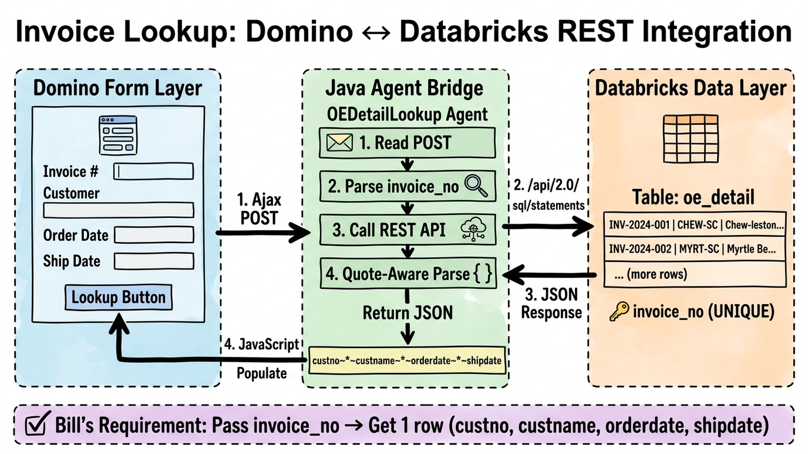

# Databricks-Domino REST Integration

**Order Entry (OE) Detail Lookup from HCL Domino Forms via Databricks SQL API**

A production-ready integration pattern for querying Databricks data from HCL Domino forms. This example implements invoice/order detail lookup, but the pattern generalizes to any Databricks table.

---

## 📋 Table of Contents

1. [Overview](#overview)
2. [Architecture](#architecture)
3. [Prerequisites](#prerequisites)
4. [Installation](#installation)
5. [Configuration](#configuration)
6. [Usage](#usage)
7. [API Reference](#api-reference)
8. [Extending for New Fields](#extending-for-new-fields)
9. [Troubleshooting](#troubleshooting)
10. [Performance Considerations](#performance-considerations)
11. [Security Best Practices](#security-best-practices)

---

## Overview

This integration allows HCL Domino forms to lookup order/invoice details from a Databricks table via REST API.

### What You Get

- ✅ **Databricks Table**: `prd_gold.facts.oe_detail` with 20 sample invoices
- ✅ **Domino Java Agent**: `OEDetailLookup` — secure REST API integration
- ✅ **JavaScript Frontend**: jQuery-based Ajax form population
- ✅ **Test Script**: Validate Databricks connectivity
- ✅ **Secure Configuration**: PAT stored in Domino environment document (never hardcoded)

### Use Cases

- **Invoice Lookup**: Enter invoice number → auto-populate customer info, order/ship dates
- **Order Status**: Track order details from Domino without leaving the form
- **Customer Inquiry**: Quick reference for customer data during Domino form entry
- **Integration Template**: Pattern extends to any Databricks table with 1-2 field changes

---

## Architecture

### Visual Architecture Diagram



### Flow Description

**3-Layer Architecture:**

1. **Domino Form Layer** (Left)
   - User enters invoice number
   - Clicks "Lookup" button
   - jQuery initiates Ajax POST

2. **Java Agent Bridge** (Middle)
   - `OEDetailLookup` reads POST body
   - Parses invoice parameter
   - Calls Databricks `/api/2.0/sql/statements` REST API
   - Quote-aware JSON parsing
   - Returns delimited result: `custno~*~custname~*~orderdate~*~shipdate`

3. **Databricks Data Layer** (Right)
   - Table: `prd_gold.facts.oe_detail`
   - 20 sample invoices with South Carolina pun company names
   - `invoice_no` is UNIQUE primary key
   - One query → One row guaranteed

**Complete Flow:**
```
Invoice # (Domino) → Ajax POST → Java Agent → REST API → Databricks
                                                              ↓
Form Fields ← JavaScript Parse ← JSON Response ← SQL Result
```

---

## Prerequisites

### Databricks
- ✅ Workspace with SQL warehouse (serverless or provisioned)
- ✅ Catalog and schema created (`prd_gold.facts`)
- ✅ Personal Access Token (PAT) or OAuth token with SQL API permissions
- ✅ Warehouse ID (visible in Workspace UI → SQL Warehouses)

### HCL Domino
- ✅ Domino Designer 12.0.2 or later
- ✅ Database with form and Java agent support
- ✅ Admin access to configure environment document
- ✅ JVM with modern TLS certificates (may need truststore import)

### Network
- ✅ Outbound HTTPS (443) access from Domino to Databricks workspace
- ✅ No firewall blocking to `*.cloud.databricks.com`

---

## Installation

### Step 1: Create Databricks Table

Run the SQL to create the table and sample data:

```bash
# Option A: Via Databricks SQL editor (web UI)
1. Open https://<workspace>.cloud.databricks.com/sql/editor
2. Copy-paste contents of sql/create_oe_detail.sql
3. Run all statements
4. Verify: SELECT COUNT(*) FROM prd_gold.facts.oe_detail  → expect 20

# Option B: Via CLI
databricks sql -f sql/create_oe_detail.sql
```

**Verification Query:**
```sql
SELECT * FROM prd_gold.facts.oe_detail ORDER BY invoice_no LIMIT 5;
```

Expected output: 5 invoices with custno, custname, orderdate, shipdate columns.

### Step 2: Gather Databricks Configuration

From your Databricks workspace, collect:

1. **DATABRICKS_HOST**: Workspace hostname (e.g., `dbc-a1b2c3d4.cloud.databricks.com`)
   - Find in browser URL or Settings → Account

2. **DATABRICKS_TOKEN**: Personal Access Token
   - Generate in Settings → Developer → Access tokens → Generate new token
   - **Keep this secret** — use Domino environment document, never commit to repo

3. **WAREHOUSE_ID**: SQL warehouse identifier
   - Find in Databricks UI → SQL Warehouses → click warehouse → copy ID from URL
   - Example: `4bbaafe9538467a0`

### Step 3: Configure Domino Environment Document

The Java agent reads Databricks credentials from a **Domino environment document** — never hardcoded in source.

1. **In Domino Designer**, open your database
2. **Create a new design element**: Design → Other → Environment Document
3. **Name it** (optional, e.g., "DatabricksConfig")
4. **Add three fields** (append field to form):

   | Field Name | Type | Value |
   |------------|------|-------|
   | `DATABRICKS_HOST` | Text | `dbc-a1b2c3d4.cloud.databricks.com` |
   | `DATABRICKS_TOKEN` | Text (or Password) | `dapi...` (your PAT) |
   | `WAREHOUSE_ID` | Text | `4bbaafe9538467a0` |

5. **Save the environment document**

**Why environment document?**
- Credentials are never hardcoded in source → safe to commit/share code
- Easy to update without recompiling Java agent
- Domino encrypts field values (especially Password type fields)
- Different environment documents for dev/test/prod

### Step 4: Import Java Agent into Domino

1. **In Domino Designer**, open your database
2. **Design → Agents**
3. **Right-click → Import**
4. **Select `java/OEDetailLookup.java`**
5. **Confirm import** — Designer auto-compiles with Domino JVM

**Verify import:**
- Agent should appear in design list: `OEDetailLookup`
- Right-click → Properties → Agent tab → Interpreter should be "Java"

### Step 5: Add JavaScript to Domino Form

1. **In Designer**, open your form (or create new)
2. **Click form → Edit form in Designer** (if not already open)
3. **Navigate to**: Design → Code → Client Library
4. **Paste contents of `js/oe-lookup.js`** at the bottom
5. **Or link the JS** via external reference if your form supports it

**Alternative: Inline in form HTML**
```html
<script src="/path/to/oe-lookup.js"></script>
```

### Step 6: Create Invoice Lookup Form

Create a Domino form with these fields:

```
Form Name: OrderEntry  (or similar)

Field 1:
  Name:        InvoiceNo
  Type:        Text
  Label:       Invoice #
  HTML:        <input id="InvoiceNo" name="InvoiceNo" type="text" />

Field 2:
  Name:        CustomerNo
  Type:        Text
  Label:       Customer #
  HTML:        <input id="CustomerNo" name="CustomerNo" type="text" disabled />

Field 3:
  Name:        CustomerName
  Type:        Text
  Label:       Customer Name
  HTML:        <input id="CustomerName" name="CustomerName" type="text" disabled />

Field 4:
  Name:        OrderDate
  Type:        Text
  Label:       Order Date
  HTML:        <input id="OrderDate" name="OrderDate" type="text" disabled />

Field 5:
  Name:        ShipDate
  Type:        Text
  Label:       Ship Date
  HTML:        <input id="ShipDate" name="ShipDate" type="text" disabled />

Button:
  Name:        LookupBtn
  Type:        Button
  Label:       Lookup
  HTML:        <button id="LookupBtn">Lookup</button>
```

### Step 7: Set Database ACL

The Java agent and form must have proper permissions:

1. **In Designer**, open database → File → Database Access Control
2. **User/Group**: Add yourself (and users who'll use the form)
3. **Access level**: **Editor** or **Manager** (agents need this)
4. **Roles**: Check `[AgentExecutor]` if using role-based execution
5. **Save and close**

---

## Configuration

### Environment Document Fields

| Field | Type | Example | Notes |
|-------|------|---------|-------|
| `DATABRICKS_HOST` | Text | `dbc-a1b2c3d4.cloud.databricks.com` | Workspace hostname (no https://) |
| `DATABRICKS_TOKEN` | Text/Password | `dapi123...` | PAT with SQL API permissions |
| `WAREHOUSE_ID` | Text | `4bbaafe9538467a0` | SQL warehouse ID (not name) |

### Connection Timeouts

In `OEDetailLookup.java`, adjust if needed:

```java
private static final int CONNECT_TIMEOUT_MS = 10000;  // 10 seconds
private static final int READ_TIMEOUT_MS = 35000;     // 35 seconds
```

- **CONNECT_TIMEOUT**: Time to establish connection (increase if warehouse is cold-starting)
- **READ_TIMEOUT**: Time to wait for query results (increase for large result sets)

### SQL Query

To modify the query executed, edit in `OEDetailLookup.java`:

```java
String sqlStatement = "SELECT custno, custname, orderdate, shipdate FROM prd_gold.facts.oe_detail WHERE invoice_no = :invoice_no";
```

---

## Usage

### User Experience

1. Open Domino form
2. Enter invoice number (e.g., `INV-2024-001`)
3. Click **Lookup** button (or trigger on field change)
4. Wait 2-3 seconds → fields auto-populate:
   - Customer #: `CUST001`
   - Customer Name: `Acme Corporation`
   - Order Date: `01/05/2024`
   - Ship Date: `01/10/2024`

### Error Handling

If lookup fails:
- **"Invalid or missing invoice number"** → Check invoice field is not empty
- **"Databricks configuration missing"** → Verify environment document has all 3 fields
- **"Databricks API error: 401"** → PAT expired or invalid; regenerate in Databricks
- **"Databricks API error: 403"** → Token lacks SQL API permissions; check Databricks admin permissions
- **"Connection to Databricks timed out"** → Warehouse is cold; wait or increase timeout
- **"No invoice found for INV-123"** → Invoice doesn't exist in table; verify invoice number

---

## API Reference

### Java Agent: `OEDetailLookup`

**HTTP Endpoint:**
```
POST /<database>.nsf/OEDetailLookup?OpenAgent
Content-Type: application/x-www-form-urlencoded

Body:
invoice=INV-2024-001
```

**Success Response:**
```
Content-Type: text/plain

CUST001~*~Acme Corporation~*~2024-01-05~*~2024-01-10
```

**Error Response:**
```
ERROR~*~Databricks API error: 401 - Unauthorized
```

### Databricks SQL Statement API

The Java agent calls this endpoint:
```
POST https://<workspace>/api/2.0/sql/statements
Authorization: Bearer <PAT>
Content-Type: application/json

{
  "warehouse_id": "4bbaafe9538467a0",
  "statement": "SELECT custno, custname, orderdate, shipdate FROM prd_gold.facts.oe_detail WHERE invoice_no = :invoice_no",
  "parameters": [
    {"name": "invoice_no", "value": "INV-2024-001", "type": "STRING"}
  ],
  "wait_timeout": "30s"
}
```

**Response (success):**
```json
{
  "statement_id": "...",
  "status": {
    "state": "SUCCEEDED",
    "result": {
      "data_array": [
        ["CUST001", "Acme Corporation", "2024-01-05", "2024-01-10"]
      ]
    }
  }
}
```

---

## Extending for New Fields

### Scenario: Add a PO Number field

You want to display the `ponumber` field from the database.

#### Step 1: Update SQL Query (Java Agent)

Edit `OEDetailLookup.java`:

```java
// OLD:
String sqlStatement = "SELECT custno, custname, orderdate, shipdate FROM prd_gold.facts.oe_detail WHERE invoice_no = :invoice_no";

// NEW:
String sqlStatement = "SELECT custno, custname, orderdate, shipdate, ponumber FROM prd_gold.facts.oe_detail WHERE invoice_no = :invoice_no";
```

#### Step 2: Update Response Format (Java Agent)

In `NotesMain()` method, find this line:

```java
// OLD:
String result = values[0] + DELIMITER + values[1] + DELIMITER + values[2] + DELIMITER + values[3];

// NEW:
String result = values[0] + DELIMITER + values[1] + DELIMITER + values[2] + DELIMITER + values[3] + DELIMITER + values[4];
```

Also update the comment in `parseDataArrayValues()`:

```java
// OLD:
if (values == null || values.length < 4) {

// NEW:
if (values == null || values.length < 5) {
```

#### Step 3: Update JavaScript (Form)

Edit `js/oe-lookup.js`:

```javascript
// OLD:
if (parts.length < 4) {
  showError("Unexpected response format from server.");
  return;
}
...
var custNo = getValue(parts[0]);
var custName = getValue(parts[1]);
var orderDate = formatDate(getValue(parts[2]));
var shipDate = formatDate(getValue(parts[3]));

$("#CustomerNo").val(custNo);
$("#CustomerName").val(custName);
$("#OrderDate").val(orderDate);
$("#ShipDate").val(shipDate);

// NEW:
if (parts.length < 5) {
  showError("Unexpected response format from server.");
  return;
}
...
var custNo = getValue(parts[0]);
var custName = getValue(parts[1]);
var orderDate = formatDate(getValue(parts[2]));
var shipDate = formatDate(getValue(parts[3]));
var poNumber = getValue(parts[4]);

$("#CustomerNo").val(custNo);
$("#CustomerName").val(custName);
$("#OrderDate").val(orderDate);
$("#ShipDate").val(shipDate);
$("#PONumber").val(poNumber);
```

Also update the field mapping comment:

```javascript
// OLD:
// Current field mapping (4 fields):
//   0 = custno (Customer Number)
//   1 = custname (Customer Name)
//   2 = orderdate (Order Date) [formatted MM/DD/YYYY]
//   3 = shipdate (Ship Date) [formatted MM/DD/YYYY, nullable]

// NEW:
// Current field mapping (5 fields):
//   0 = custno (Customer Number)
//   1 = custname (Customer Name)
//   2 = orderdate (Order Date) [formatted MM/DD/YYYY]
//   3 = shipdate (Ship Date) [formatted MM/DD/YYYY, nullable]
//   4 = ponumber (PO Number)
```

#### Step 4: Update Domino Form

Add a new field to your form:

```
Field:
  Name:        PONumber
  Type:        Text
  Label:       PO #
  HTML:        <input id="PONumber" name="PONumber" type="text" disabled />
```

#### Step 5: Test

1. Re-import `OEDetailLookup.java` into Domino (Designer will auto-compile)
2. Reload the form
3. Look up an invoice
4. Verify PO number field populates: `PO-2024-001`

---

## Troubleshooting

### Connection Issues

#### `SSLHandshakeException` or certificate validation error

**Problem:** Domino JVM doesn't trust Databricks certificate

**Solution:**
1. Export Databricks certificate:
   ```bash
   # Get the cert from Databricks workspace (replace with your host)
   openssl s_client -connect dbc-a1b2c3d4.cloud.databricks.com:443 -showcerts < /dev/null | \
     grep -A 50 "BEGIN CERTIFICATE" > databricks.cer
   ```

2. Import into Domino JVM truststore:
   ```bash
   # Find Domino JVM path (macOS example; adjust for your OS)
   DOMINO_JVM="/Applications/HCL Domino.app/Contents/Frameworks/jvm/Contents/Home"
   
   # Import certificate
   "$DOMINO_JVM/bin/keytool" -import -alias databricks \
     -file databricks.cer \
     -keystore "$DOMINO_JVM/lib/security/cacerts" \
     -storepass changeit -noprompt
   ```

3. Restart Domino server

#### `401 Unauthorized`

**Problem:** Invalid or expired PAT

**Solution:**
1. In Databricks UI → Settings → Developer → Access tokens
2. Check token expiration date
3. Generate new token if expired
4. Update DATABRICKS_TOKEN in environment document
5. Verify token has SQL API permissions

#### `403 Forbidden`

**Problem:** Token lacks SQL API permissions

**Solution:**
1. In Databricks UI → Admin console → Users
2. Find your user
3. Check SQL API workspace permission is enabled
4. If not, add the permission

#### `404 Not Found`

**Problem:** Invalid warehouse ID or endpoint

**Solution:**
1. Verify WAREHOUSE_ID in environment document
2. In Databricks UI → SQL Warehouses → copy ID from URL bar
3. Check warehouse is created and in Running state
4. Try starting warehouse if stopped

#### `Connection timeout`

**Problem:** Warehouse is cold-starting or query is slow

**Solution:**
1. Increase READ_TIMEOUT_MS in Java agent to 60000 (60 seconds)
2. Use serverless warehouse (starts faster)
3. Check warehouse auto-resume is enabled in Databricks settings
4. Wait for warehouse to warm up and retry

### Data Issues

#### No results returned ("No invoice found...")

**Problem:** Invoice number doesn't exist in table

**Solution:**
1. Verify invoice exists:
   ```sql
   SELECT * FROM prd_gold.facts.oe_detail WHERE invoice_no = 'INV-2024-001';
   ```
2. Check spelling and case (case-insensitive by default, but verify)
3. Ensure correct table: `prd_gold.facts.oe_detail`

#### Null values display as "null" string

**Problem:** JavaScript is not handling null correctly

**Solution:**
1. Check `sanitizeValue()` in Java agent returns empty string for null literal
2. Check `getValue()` in JavaScript handles "null" string:
   ```javascript
   if (!value || value === "null" || value.trim() === "") {
     return "";
   }
   ```

#### Dates not formatting correctly

**Problem:** JavaScript formatDate() receives unexpected format

**Solution:**
1. Verify Databricks returns DATE as `YYYY-MM-DD` string
2. Check SQL query: `SELECT orderdate::string ...` if using DATE type
3. Test with curl script: `./test/test-api-call.sh INV-2024-001`

### Domino-Specific Issues

#### Agent doesn't compile

**Problem:** Syntax error or missing Domino JARs

**Solution:**
1. In Designer, double-click agent → Edit
2. Check Agent → Java Compiler output for errors
3. Verify imports are correct: `lotus.domino.*`, `java.net.*`
4. Common issue: Wrong exception class — use `java.net.SocketTimeoutException`

#### Agent runs but returns no output

**Problem:** Content-Type header not written, or exception silently failing

**Solution:**
1. Check agent execution result in Domino logs
2. Verify this line executes: `writer.println("Content-Type: text/plain");`
3. Add debug logging by modifying agent output:
   ```java
   writer.println("DEBUG: reached checkpoint 1");
   ```

#### Form field IDs don't match

**Problem:** JavaScript uses `$("#InvoiceNo")` but form field is named differently

**Solution:**
1. In Designer, right-click form field → Properties
2. Check "HTML Attributes" → verify `id="InvoiceNo"`
3. Ensure all 5 fields have matching IDs:
   - `InvoiceNo`, `CustomerNo`, `CustomerName`, `OrderDate`, `ShipDate`, `LookupBtn`

---

## Performance Considerations

### SQL Warehouse Settings

- **Serverless warehouse** (recommended): Starts in ~10s, scales automatically
- **Provisioned warehouse**: Faster once started, but requires manual scaling
- **Auto-resume**: Enable in warehouse settings to avoid cold starts
- **Auto-suspend**: Set to 5-10 minutes to save costs

### Query Optimization

Current query:
```sql
SELECT custno, custname, orderdate, shipdate FROM prd_gold.facts.oe_detail WHERE invoice_no = :invoice_no
```

**For large tables (100K+ rows):**
- Add index: `CREATE INDEX idx_invoice_no ON prd_gold.facts.oe_detail(invoice_no);`
- Add partition: `PARTITION BY YEAR(orderdate)`

### Concurrent Usage

- Databricks SQL Warehouse auto-scales to support concurrent queries
- Domino connection pooling: Adjust `lotus.properties` if high concurrency
- Test with load tool to verify warehouse capacity

---

## Security Best Practices

### PAT Management

- ✅ Store in Domino environment document (encrypted)
- ✅ Use minimal-scope token (SQL API only, not admin)
- ✅ Rotate annually or when employees leave
- ❌ Never commit PAT to Git
- ❌ Never log PAT to console
- ❌ Never hardcode in Java source

### Network Security

- ✅ Use HTTPS only (enforced by agent)
- ✅ Verify TLS certificates (keytool import for custom CA)
- ✅ Firewall database ACL to authorized users
- ✅ Consider IP allowlisting in Databricks workspace

### Data Security

- ✅ Query returns only necessary columns
- ✅ Use parameterized queries (prevents SQL injection)
- ✅ Audit Databricks access via system tables (system.access.audit)
- ✅ Enable Databricks password policy

### Code Security

- ✅ Code review before deploying agent
- ✅ Log all API calls to Domino console (for debugging)
- ✅ Monitor Databricks audit logs for unusual activity
- ✅ Test error handling to avoid info leaks

---

## Production Deployment Checklist

Before deploying to production, verify all items below:

### Databricks Setup
- [ ] Table created: `SELECT COUNT(*) FROM prd_gold.facts.oe_detail;` → expect 20
- [ ] SQL warehouse started and running
- [ ] Warehouse auto-resume enabled in settings
- [ ] PAT generated with SQL API permissions
- [ ] Test query works: `SELECT * FROM prd_gold.facts.oe_detail WHERE invoice_no = 'INV-2024-001';`
- [ ] Databricks audit logging enabled (optional but recommended)

### Domino Configuration
- [ ] Environment document created with 3 fields:
  - `DATABRICKS_HOST`: Workspace hostname
  - `DATABRICKS_TOKEN`: PAT (Password type field recommended)
  - `WAREHOUSE_ID`: SQL warehouse ID
- [ ] Java agent `OEDetailLookup` imported and compiled
- [ ] JavaScript `oe-lookup.js` added to form
- [ ] Form fields created: `InvoiceNo`, `CustomerNo`, `CustomerName`, `OrderDate`, `ShipDate`, `LookupBtn`
- [ ] Database ACL configured (allow Editor or Manager access)
- [ ] Agent execution rights tested (call from form successfully)

### Testing Before Go-Live
- [ ] Test with `INV-2024-001` → should return "Chew-leston Charms Trading Co"
- [ ] Test with `INV-2024-004` → should show NULL shipdate (unshipped order)
- [ ] Test error case: invalid invoice → should show "No invoice found" message
- [ ] Test timeout handling: disable warehouse, verify timeout error displayed
- [ ] Test with multiple concurrent users (if high volume expected)

### Post-Deployment
- [ ] Monitor Domino console for errors in first week
- [ ] Check Databricks audit logs for unexpected queries
- [ ] Document any customizations made to the form
- [ ] Create backup of environment document configuration
- [ ] Set PAT rotation reminder (annually)
- [ ] Document support process for users (who to contact if lookup fails)

### Performance Tuning (Optional)
- [ ] If warehouse cold-starts are slow, increase `READ_TIMEOUT_MS` to 60000
- [ ] If high concurrency (100+ concurrent users), verify warehouse size
- [ ] Monitor query execution time in Databricks SQL editor

### Monitoring & Alerts (Recommended)
- [ ] Set up Domino agent error logging to syslog/monitoring tool
- [ ] Create Databricks alert if `prd_gold.facts.oe_detail` row count changes unexpectedly
- [ ] Monitor Databricks SQL warehouse costs in workspace settings
- [ ] Set PAT expiration reminder in calendar

---

## Testing

### Test 1: Databricks Connectivity

```bash
export DATABRICKS_HOST=dbc-a1b2c3d4.cloud.databricks.com
export DATABRICKS_TOKEN=dapi...
export WAREHOUSE_ID=4bbaafe9538467a0

./test/test-api-call.sh "INV-2024-001"

# Expected output:
# ✓ Query succeeded
# Status: SUCCESS
```

### Test 2: Domino Agent

1. In Designer, open agent `OEDetailLookup`
2. Click **Run** button
3. Check Java console output for errors

### Test 3: Form Integration

1. Open form in Notes client
2. Enter invoice number: `INV-2024-001`
3. Click **Lookup**
4. Verify fields populate within 5 seconds
5. Try invalid invoice: verify error message appears

### Test 4: Error Scenarios

| Scenario | Expected | How to Test |
|----------|----------|------------|
| Invalid invoice | "No invoice found for ABC" | Enter `ABC` in invoice field |
| Missing invoice | Alert on form | Leave invoice blank, click Lookup |
| Bad token | "API error: 401 Unauthorized" | Set bad DATABRICKS_TOKEN, lookup |
| Bad warehouse | "API error: 404 Not Found" | Set bad WAREHOUSE_ID, lookup |

---

## Support & Contribution

### Issues

1. Check **Troubleshooting** section above
2. Run test script: `./test/test-api-call.sh`
3. Check Domino agent logs
4. Check Databricks SQL warehouse query history

### Contributing

1. Fork the repo
2. Create feature branch: `git checkout -b feature/new-fields`
3. Commit changes: `git commit -am 'Add ponumber field'`
4. Push and open PR

---

## License

Apache License 2.0 — See LICENSE file for details

---

## Reference Material

- [Databricks SQL Statement API](https://docs.databricks.com/api/workspace/statementexecution)
- [HCL Domino REST API](https://opensource.hcltechsw.com/Domino-rest-api/)
- [Domino Java Agent Development](https://www.ibm.com/support/knowledgecenter/SSVRGU_9.0.0/admin/cag_jsagent.html)
- [Java HttpURLConnection](https://docs.oracle.com/javase/tutorial/networking/urls/readingURL.html)
- [Parameterized Queries in SQL](https://owasp.org/www-community/attacks/SQL_Injection)

---

**Last Updated**: 2026-03-24  
**Version**: 1.0  
**Tested With**: HCL Domino 12.0.2+, Databricks SQL API v2.0
